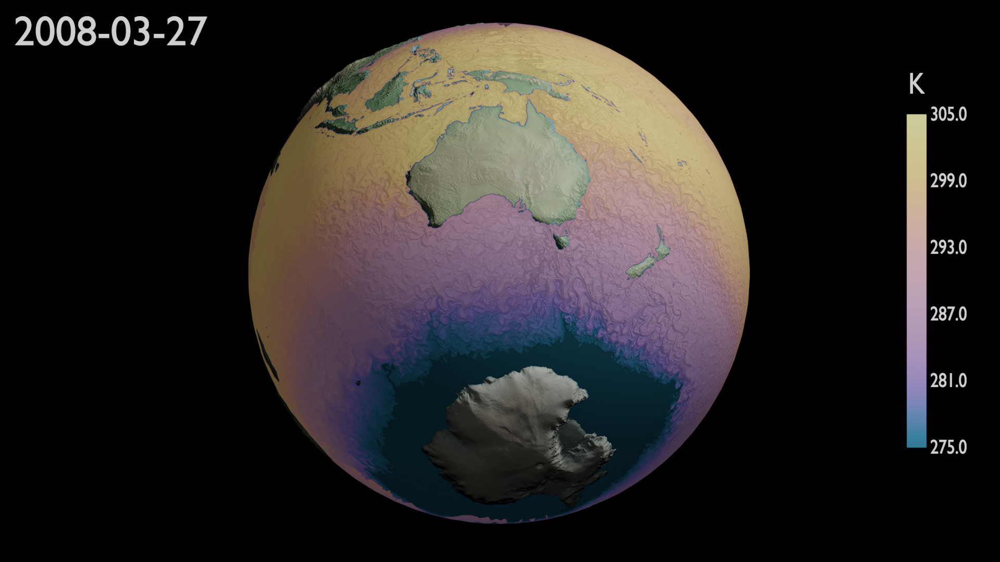

=================================
Sea-surface Temperature animation
=================================

This example animates the sea-surface temperature (SST) from the ACCESS-OM2 global ocean-sea ice model. 
The files loaded for these animations are located at:

.. code-block:: bash

    /g/data/cj50/access-om2/raw-output/access-om2-01/01deg_jra55v140_iaf/output2*/ocean/ocean-2d-surface_temp-1-daily-mean-ym_20*.nc

and the variable name is:

.. code-block:: bash

    surface_temp

.. note::
    The path contains the wildcard ``*``  which allows the load of all the files contained in the repositories ``output2*`` and the netCDF files named ``ocean-2d-surface_temp-1-daily-mean-ym_20*.nc```


The animation consists of the sea-surface temperature on a sphere with the continents displaced to their given elevation and the texture displayed over the continents corresponds to the `natural earth  <https://www.naturalearthdata.com/>`_ dataset. Here's a snapshot of the animation: 




Download
--------

The provided animation can be found in `YouTube <>`_ or directly donwloaded by `clicking here <>`_

.. raw:: html

    <br>

.. note:: The provided animation has been edited to replace the date format from a string to a clock-like calendar. 

Reproduce Animation
-------------------

To reproduce the animation, make sure to install ``Blender`` and  ``BlenderNC`` by following the instructions at :ref:`installation`, and download this animation ``access_sst.blend`` file by `clicking here <https://github.com/COSIMA/3D_animations/raw/main/salinty/access_salinity.blend>`_.

After downloading the blender file and opening it in VDI or your rendering computer of preference, make sure to reconnect the BlenderNC nodes by following the instruction below:

1. Navigate to the BlenderNC nodetree:
   
2. Disconnect the output of the input node to update the nodetree:

3. Select the ``surface_temp`` variable:

4. Connect all the nodes in order:
   
5. Render image:

Now you can modify anything in the animation, from the lighting, the material, colorbar, to the dataset used for the animation. 
