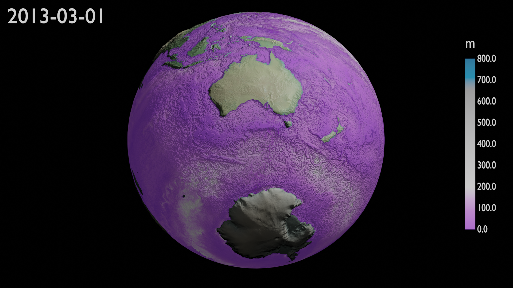

=============
MLD animation
=============

This animation corresponds to a set of 3 simple animations:
 - Mixed Layer Depth
 - Sea Surface Temperature 
 - Sea Surface Salinity

from the ACCESS-OM2 ocean model. These animations load data for one individual variable. For this animation, the files loaded corresponds to:

.. code-block:: bash

    /g/data/cj50/access-om2/raw-output/access-om2-01/01deg_jra55v140_iaf/output2*/ocean/ocean-2d-mld-1-daily-mean-ym_20*.nc

the variable:

.. code-block:: bash

    mld

.. note::
    The path contains the wildcard ``*``  which allows the load of all the files contained in the repositories ``output2*`` and the netCDF files named ``ocean-2d-mld-1-daily-mean-ym_20*.nc```





Donwload Blender file by `clicking here <https://github.com/COSIMA/3D_animations/raw/main/mld/access_mld.blend>`_